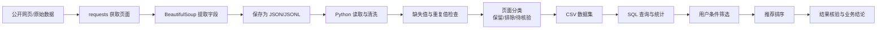

# 留学项目数据采集与选校分析流程

## 1. 项目简介

本项目模拟留学数据岗位中的基础工作流程，围绕学校与项目数据完成：

网页数据采集、字段提取、数据清洗、缺失值检查、重复值检查、用户条件筛选、项目推荐排序和结果导出。

整体流程：

网页数据
→ Python 提取
→ pandas 清洗
→ 数据质量检查
→ 用户条件筛选
→ 推荐排序
→ CSV 导出

## 2. 项目目标

模拟以下业务场景：

- 整理学校和项目相关信息；
- 提取网页中的结构化字段；
- 处理费用、语言成绩和来源链接；
- 根据用户画像筛选候选项目；
- 对缺失和异常数据进行标记；
- 输出可供后续分析的结构化结果。

## 3. 技术栈

- Python 3.13
- requests
- BeautifulSoup
- pandas
- SQL
- SQLite / MySQL
- Git

## 4. 项目结构

```text
Program/
├── data/
│   ├── programs.csv
│   ├── books_scraped.csv
│   ├── books_pagination.csv
│   ├── books_pipeline_result.csv
│   ├── pandas_basic.py
│   ├── pandas_tuition2.py
│   ├── data_quality_report.py
│   ├── program_filter_v4.py
│   ├── program_recommend.py
│   ├── scraper_basic.py
│   ├── scraper_book_details.py
│   ├── scraper_book_details_v2.py
│   ├── scraper_book_export.py
│   ├── scraper_pagination.py
│   └── run_pipeline.py
├── sql/
│   ├── schema.sql
│   └── questions.sql
└── README.md

```

## 5. 项目流程




项目按照“采集—结构化—清洗—检查—分析—推荐”的流程处理数据。

其中，JSON/JSONL 用于保存原始结构化数据，CSV 用于后续分析和结果导出。对于无法确认的页面或字段，不直接删除或填充，而是标记为待核验。
